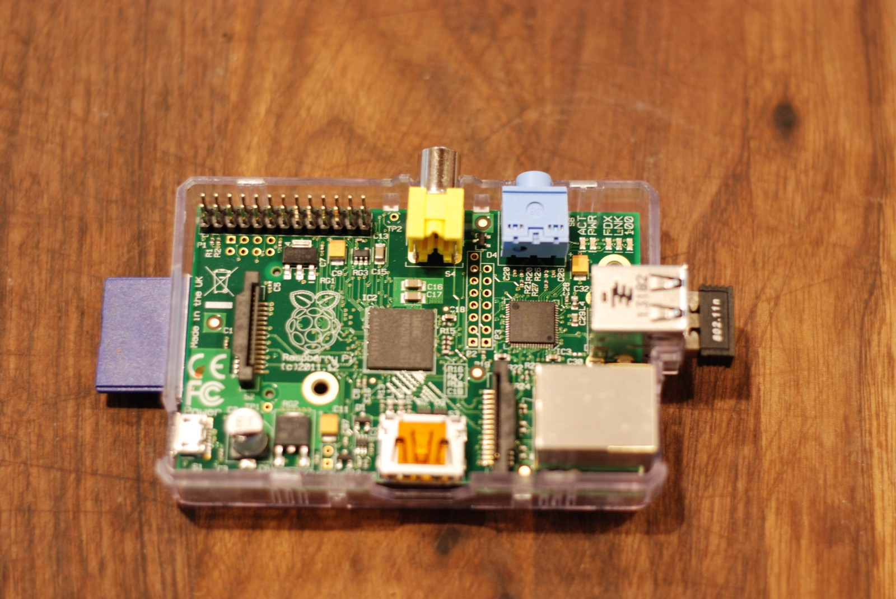
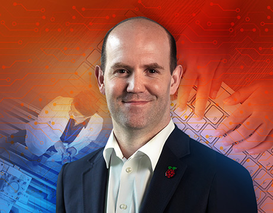
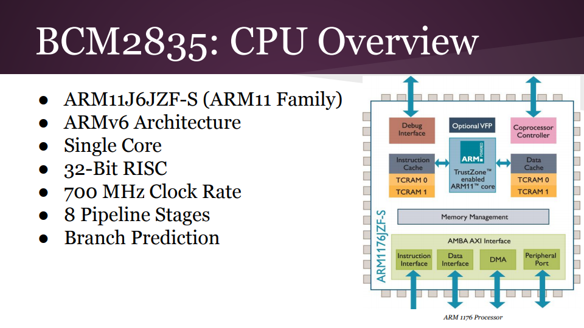
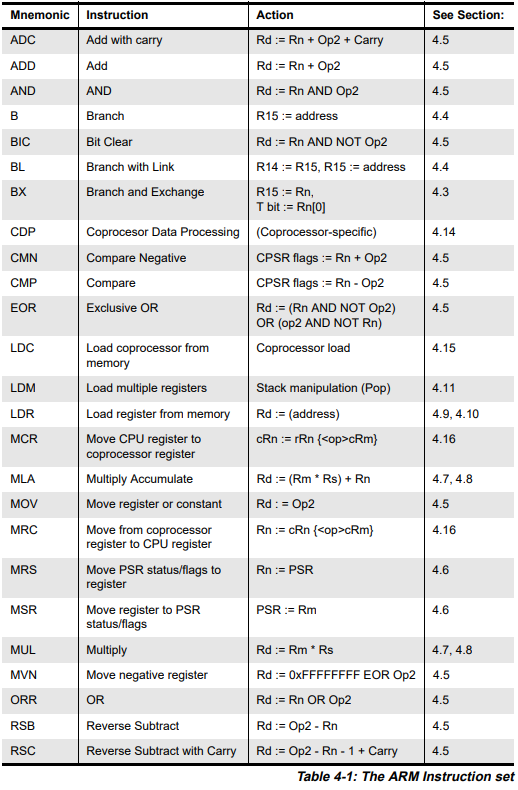

Group Project 1: Exploring Hardware
###################################
..  vim:ft=rst spell:

**Lab Report: Lambda Group**
============================

Board History [Arman Levanti]
=============================

Originally created by the Raspberry Pi Foundation in February of 2012, it's primary goal was to allow a wider audience of students to experience practical Computer Science firsthand at an affordable price. Almost immediately it took the tech scene by storm as enthusiasts and amateurs alike found many uses for the cheap self-contained board beyond it's original intended purpose of being just an educational tool. ( `#1a`_ ) The model introduced to the public market in 2012 was the Raspberry Pi 1 B. At the low price of only $35 it boasted a 700MHz ARMv6 single-core CPU, 256mb of Memory, one USB port and HDMI output. Impressively the Raspberry Pi Foundation was able to fit all this hardware onto a board roughly 3.4in x 2.2in, or about the size of your typical credit card. ( `#3a`_ ) It's compactness, availability and affordability all contributed to making it a mainstay in most hobbyist circles at the time. Over the following years, the Foundation released a number of improved and cheaper models, allowing consumers to select the board that best suits their needs for the application.

*Hardware of the first-gen Raspberry Pi*

(source: freecodecamp.org | `#2a`_ )

The Raspberry Pi natively supports the Foundation's own custom Linux distribution named Raspbian, which is primarily adapted from the existing Debian distro. However, the Raspberry Pi also supports the use of a variety of other operating systems, both Linux-based and non-Linux-based OS's. Raspbian's goal was to provide its users with a free operating system that was easy for anyone to install while creating an OS optimized specifically for the Pi's hardware that ensures smooth performance. ( `#4a`_ )

*Raspbian Distro Logo*

.. image:: img/raspbian_logo.png

(source: raspbian.org | `#4a`_ )

The founder and current CEO of The Raspberry Pi Foundation is Eben Upton, a forty-year-old English man with a Ph.D in Computer Science. Upton originally started planning the architecture of the Raspberry Pi in 2006, his goals at the time were to create a low cost, easily programmable computer that students and kids could have fun learning with. While engineering the prototype, he built it with the objective of keeping the cost of the computer under the price tag of $25, this posed a lot of challenges for the team during the designing process. The first model of the Raspberry Pi contained roughly 200 components on its small board. Upton is very positive about the impact that Raspberry Pi has had on the world up to this point, stating that "The general-purpose computer has been a success as a product and Raspberry Pi has proven to be a powerful tool not just for students, but for anyone who wants to do general automation of tasks." ( `#5a`_ )

*Eben Upton, creator of the Raspberry Pi*

(source: asme.org | `#5a`_ )

While the Raspberry Pi may not be the only single-board computer on the market, it's cheap price and accessibility to people of virtually any computing level makes it a very powerful tool that continues to prove timeless.

Basic Board Setup [Michael Beebower]
====================================

To setup a Raspberry Pi 2 or 3 system (larger, more complete than Pi Zero), you will typically need the following items:

* Raspberry Pi (main board)
* MicroSD Card loaded with NOOBS
* HDMI Monitor
* HDMI Cable
* USB Keyboard
* USB Mouse
* MicroUSB Power Adapter
* [Optional] Ethernet Cable for connection to a wired-network
* [Optional] Raspberry Pi compatible USB WiFi Adapter
* [Optional] A case to hold and protect your Raspberry Pi

NOOBS (New Out Of the Box Software) is an easy operating system installer which contains Raspbian. It also provides a selection of alternative operating systems which are then downloaded from the internet and installed. ( `#6`_ )

The MicroUSB Power Adapter we are using is a 2.5A power supply. It takes an input of 100-240 V AC, 50-60 Hz, and 0.5 A. It outputs 5 V and 2.5 A, which is what the Raspberry Pi main board requires. ( `#7`_ )

To setup a Pi Zero system (smaller than Raspberry 2 or 3), you will need the following items:

* Pi Zero Board
* Case
* MicroSD Card
* Mini-HDMI to HDMI Cable
* HDMI Display Monitor or TV
* USB OTG Cable (male micro USB to female USB)
* USB Hub
* USB Keyboard
* USB Mouse
* MicroUSB Power Adapter

Development Tools [Michael Beebower]
====================================

GNU Compiler = gcc (the C compiler on Ubuntu)
There are many development tools already installed by default with Raspbian 
https://raspberrypi.stackexchange.com/questions/4813/how-to-install-gnu-c-development-tools-on-raspberry-pi-using-apt-get
https://www.networkworld.com/article/3088683/article.html

https://www.raspberrypi.org/documentation/raspbian/updating.md
$ sudo apt-get update
$ sudo apt-get dist-upgrade

$ python --version
Python 2.7.3

$ python3 --version
Python 3.2.3

$ sudo apt-get install -y vim-gtk

$ g++ --version
g++ (Debian 4.6.3-14+rpi1) 4.6.3

$ make --version
GNU Make 4.0
Built for arm-unknown-linux-gnueabihf

$ startx
begins GUI environment

can't install Sublime Text because there's no ARM build
https://raspberrypi.stackexchange.com/questions/54711/installing-sublime-text-on-raspberry-pi

$ sudo apt-get install bluefish
(a different GUI-based text editor)

Processor Architecture [Arman Levanti]
======================================

The current generation of Raspberry Pi 3 Model B+'s come loaded with a powerful 1.4GHz, 64-bit quad-core Broadcom Arm Cortex-A53 processor. This is a fairly significant improvement over the previous model that translates to almost a 15% performance improvement in processing power. ( `#8a`_ ) This model of processor includes the ARMv8-A instruction set designed by the ARM Holdings' Cambridge design center. In addition to performance enhancements, this new model includes "64-bit data processing, extended virtual addressing and a 64-bit general purpose registers". ( `#11a`_ ) 

*Benchmark comparasion test between generations*

.. image:: img/raspi-cpu-benchmark.png

(source: raspberrypi.org | `#9a`_ )

The general layout of the board's CPU has remained more or less the same between generations, the main difference between models usually comes down to increasing the performance of the Cores as well as optimizing various other components to promote better energy and runtime performance. ( `#13a`_ )

*Overview of a ARM processor's general architecture found in a previous Raspi model*

(source: macs.hw.ac.uk | `#10a`_ )

Processor Assembly Language [Arman Levanti]
===========================================

The Raspberry Pi Model 3B+ utilizes an ARMv8-A processor and as such, can interpret instructions written in the ARM assembly language. There's a multitude of defining features between Intel and ARM processors, the main difference being the complexity of their respective instruction sets. Intel chips are CISC (Complex Instruction Set Computing) processors that have larger, more feature-rice instruction set allowing for more complexity in assembly instruction. ARM chips are RISC (Reduced Instruction Set Computing) processors which in turn gives it a less complex instruction set at the cost of providing a significant amount more of general purpose registers. ( `#7a`_ ) Furthermore, another significant detail between the two chips is it's endian configuration, Intel processors use a little-endian format while ARM processors in later generations have a BI-endian format, essentially allowing for switchable endian types.

For the most part many of the main classes of the ARM instruction set are similar to those found in other established assembly architectures. Some of the main classes of instructions supported by the ARM processor include: ADD, SUB, MUL, MOV, AND, OR, CMP. ( `#12a`_ )

*A few more examples of the main instructions found inside the ARM instruction set*

(source: vision.gel.ulaval.ca | `#12a`_ )

Demonstration Project [Michael Beebower]
========================================

Arman's References
==================
1a. http://novadigitalmedia.com/history-raspberry-pi/

2a. https://medium.freecodecamp.org/raspberry-pi-just-turned-5-d4210cc29230

3a. https://www.techrepublic.com/article/inside-the-raspberry-pi-the-story-of-the-35-computer-that-changed-the-world/

4a. https://www.raspbian.org/

5a. https://www.asme.org/engineering-topics/articles/technology-and-society/raspberry-pis-eben-upton-design-innovation

6a. http://www.science.smith.edu/dftwiki/index.php/Tutorial:_Assembly_Language_with_the_Raspberry_Pi

7a. https://azeria-labs.com/writing-arm-assembly-part-1/

8a. https://www.zdnet.com/article/raspberry-pi-3-model-b-arrives-faster-cpu-wi-fi-300mbps-ethernet/

9a. https://www.raspberrypi.org/

10a. https://www.macs.hw.ac.uk/~hwloidl/Courses/F28HS/slides_RPi_arch.pdf

11a. http://www.arm.com/products/processors/cortex-a/cortex-a53-processor.php

12a. http://vision.gel.ulaval.ca/~jflalonde/cours/1001/h17/docs/arm-instructionset.pdf

13a. https://en.wikichip.org/wiki/arm_holdings/microarchitectures/cortex-a53

.. _#1a: http://novadigitalmedia.com/history-raspberry-pi/
.. _#2a: https://medium.freecodecamp.org/raspberry-pi-just-turned-5-d4210cc29230
.. _#3a: https://www.techrepublic.com/article/inside-the-raspberry-pi-the-story-of-the-35-computer-that-changed-the-world/
.. _#4a: https://www.raspbian.org/
.. _#5a: https://www.asme.org/engineering-topics/articles/technology-and-society/raspberry-pis-eben-upton-design-innovation
.. _#6a: http://www.science.smith.edu/dftwiki/index.php/Tutorial:_Assembly_Language_with_the_Raspberry_Pi
.. _#7a: https://azeria-labs.com/writing-arm-assembly-part-1/
.. _#8a: https://www.zdnet.com/article/raspberry-pi-3-model-b-arrives-faster-cpu-wi-fi-300mbps-ethernet/
.. _#9a: https://www.raspberrypi.org/
.. _#10a: https://www.macs.hw.ac.uk/~hwloidl/Courses/F28HS/slides_RPi_arch.pdf
.. _#11a: http://www.arm.com/products/processors/cortex-a/cortex-a53-processor.php
.. _#12a: http://vision.gel.ulaval.ca/~jflalonde/cours/1001/h17/docs/arm-instructionset.pdf
.. _#13a: https://en.wikichip.org/wiki/arm_holdings/microarchitectures/cortex-a53

Michael's References
====================

1. http://novadigitalmedia.com/history-raspberry-pi/

2. https://medium.freecodecamp.org/raspberry-pi-just-turned-5-d4210cc29230

3. https://www.techrepublic.com/article/inside-the-raspberry-pi-the-story-of-the-35-computer-that-changed-the-world/

4. https://www.raspbian.org/

5. https://www.asme.org/engineering-topics/articles/technology-and-society/raspberry-pis-eben-upton-design-innovation

6. https://www.imore.com/how-to-get-started-using-raspberry-pi#noobs

7. https://www.canakit.com/quick-start/pi

.. _#1: http://novadigitalmedia.com/history-raspberry-pi/
.. _#2: https://medium.freecodecamp.org/raspberry-pi-just-turned-5-d4210cc29230
.. _#3: https://www.techrepublic.com/article/inside-the-raspberry-pi-the-story-of-the-35-computer-that-changed-the-world/
.. _#4: https://www.raspbian.org/
.. _#5: https://www.asme.org/engineering-topics/articles/technology-and-society/raspberry-pis-eben-upton-design-innovation
.. _#6: https://www.imore.com/how-to-get-started-using-raspberry-pi#noobs
.. _#7: https://www.canakit.com/quick-start/pi